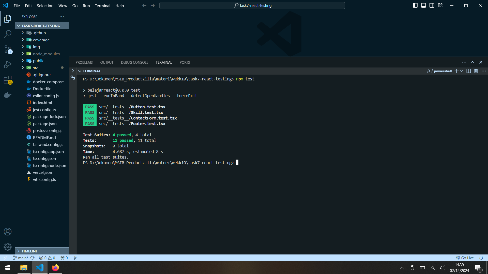
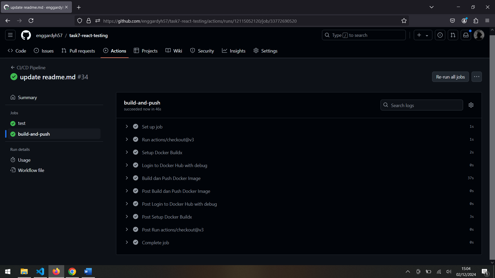

Tugas 7 Studi Independent Productzilla
Membuat testing component portofolio tugas  6
 
1.	ReactJS ✔
2.	Typescript ✔
3.	Component Testing(4 componen) ✔
4.	CI/CD ✔
5. 	Build push docker image  ✔

Hasil Test Jest:

Push Docker :

